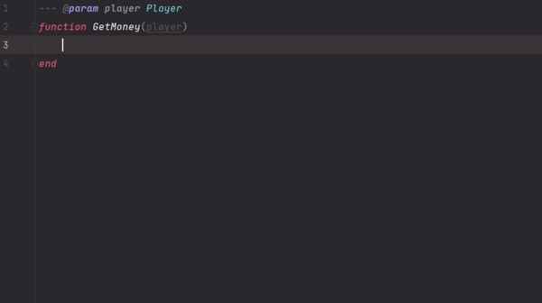

# Core Games API - Lua Types

## Why ?
When working on Lua with Core Games, even with the referenced plugins for VSCode it does not provide a good type checking.
Type checking provide a good flexible autocomplete system and give you errors when you are trying to access undefined properties.

### Without Types


### With Types


## Install
As the types are just from a simple Lua file it can be understand in any IDE, VSCode, Jetbrains, etc.
I still encourage to use Intellij IDEA, it provides stronger understanding of types.

### VSCode
In order for VSCode to understand the configuration, you must open the folder of your scripts (and not only file by file).
For that, open VSCode on your project folder.

In your scripts folder, create a new file called `types.lua` and paste the content of the [following file](core-types.lua).

> Warning : You should install the [plugins advised by core games](https://docs.coregames.com/extensions/).

### IntelliJ IDEA (or PhpStorm, Webstorm, etc)
Install the plugin [Luanalysis](https://plugins.jetbrains.com/plugin/14698-luanalysis) and open your Core Game Project with the IDE.

In your scripts folder, create a new file called `types.lua` and paste the content of the [following file](core-types.lua).

## How
Whenever you code, typing what you write is always a good thing. For you, and for the others.

### Functions
By typing your function parameters, you will be able to have full autocompletion inside your functions.
And by typing the return, you will be able to call this function anywhere in your application and still enjoying the autocomplete and the type checking.
```lua
--- @param player Player
--- @return number
function GetMoney(player)
    return player:GetResource("money")
end
```

### Locals
By typing your locals you will be able to enjoy autocomplete and type checking even on your custom properties !
```
--- @type number
local customProperty = script.parent:GetCustomProperty("customProperty")

--- @type ScriptAsset
local myScript = script.parent:GetCustomProperty("myScript")
```

### Classes
You create your own types by adding LDoc to your classes.
```lua
--- @class MyClass
MyClass = {}

return MyClass
```

Now you can use this type to enjoy autocompletion on your own modules. 
```lua
local propMyScript = script.parent:GetCustomProperty("myScript")

--- @type MyClass
local MyClass = require(propMyScript)
```
