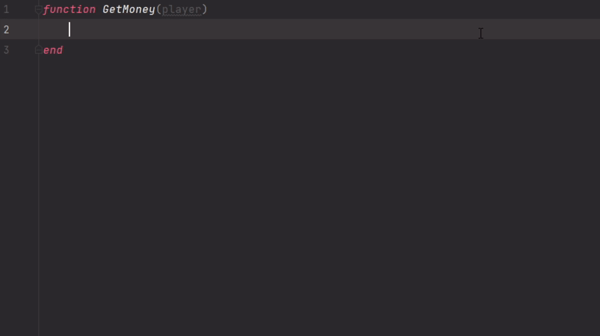

# Core Games API - Lua Types

## Why ?
When working on Lua with Core Games, even with the referenced plugins for VSCode it does not provide a good type checking.

Type checking provide a good flexible autocomplete system and give you errors when you are trying to access undefined properties.

